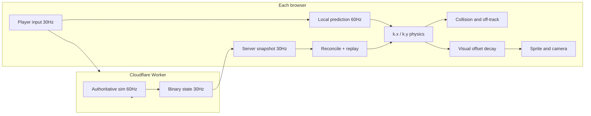
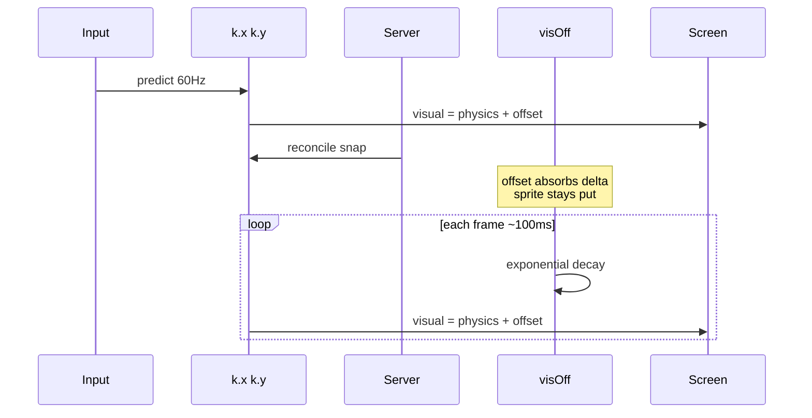

# Online Mode Fixes — Visual Offset Decay

This document explains how KartBlitz handles **smooth online driving** on a **server-authoritative** host, why earlier approaches failed, and why the current **predicted pose + decaying visual offset** model is the right solution for production hosting.

For the full network architecture (Worker, snapshots, prediction), see [online-mode.html](online-mode.html). For deploy steps, see [deploy.md](../deploy.md).

---

## The problem we were fixing

In online races, players reported:

- The car **felt responsive** (input had no lag).
- The **sprite lagged or teleported** behind where collisions and off-track penalties actually happened.
- Near track edges, the game would **stop the kart** even though the picture still looked on the painted surface.

That is a classic **physics vs rendering desync**. Input and collision use one position; the screen drew another.

---

## How KartBlitz online hosting works

KartBlitz uses **server-authoritative** multiplayer:

| Layer | Where it runs | Rate |
|-------|---------------|------|
| Simulation | Cloudflare Worker (`party/server.ts`, `sim/`) | 60 Hz |
| Snapshots to clients | Worker → all browsers | 30 Hz |
| Local prediction | Each client (`online-sim.js`) | 60 Hz |
| Remote karts | Snapshot interpolation (~80 ms delay) | Render |

The lobby **host** only picks track/settings and starts the race. **Physics always runs on the Worker**, so a host tab going to background does not freeze the session.



**Deploy rule:** ship **static client files** (`index.html`, `online.js`, `online-sim.js`) and the **Worker** together. Mismatched `ONLINE_PROTOCOL` or `TRACK_BAKE_VERSION` causes hard disconnects. Push to `main` runs [`.github/workflows/deploy.yml`](../.github/workflows/deploy.yml) (GitHub Pages + `wrangler deploy`).

---

## Approaches we tried (and why they failed)

### 1. Separate display pose with pixel chase (`_dispX` / `_dispY`)

The sprite was smoothed toward physics every frame with a rate limit (`maxStep` in px/s). On large server corrections, it either **lagged behind** (edge penalties felt wrong) or **teleported** when error exceeded a snap threshold.

**Why it fails:** You are running two positions and sliding one toward the other. That reads as rubber-banding, not driving.

### 2. Tighter lag caps and faster catch-up

Shrinking the max display lag (e.g. 28 px → 14 px) and shortening catch-up time made edge accuracy slightly better but **felt worse** — the car visibly slid sideways/forward in pixels after every correction.

### 3. PID on visual speed

We tried biasing `_dispSpeed` along the car heading so corrections looked like a small speed change. **Unit tests passed**, but in real races it still felt wrong because:

- Corrections are **2D** (collisions, replay, off-track), not just along heading.
- Physics already integrates at 60 Hz; a second integrator **fights** prediction.
- Capping “invisible” extra speed (~7%) is too slow for real correction sizes at race pace.

**Why it fails:** You are simulating a **third car** instead of smoothing the gap between physics and what you draw.

---

## The solution: predicted pose + decaying visual offset

This matches what Source-engine games, Unreal character movement, and most racing netcode do for the **local player**:

1. **Drive and collide on predicted physics** — `k.x`, `k.y`, `k.speed` (unchanged).
2. **Draw** `visual = physics + visOff` — only for the **local** kart.
3. When the server corrects physics, **do not move the sprite** on that frame. Add the correction into the offset:
   ```
   visOff += oldVisual − newPhysics
   ```
4. Each frame, **decay** the offset exponentially (~100 ms) so the error melts away while you keep steering normally.
5. **Remote karts** use interpolated snapshot poses only — no second display layer.



### Why this is the best fit for hosting

| Requirement | Visual offset decay |
|-------------|---------------------|
| Server authority | Physics still snaps to server; only **rendering** is softened |
| No input lag | Prediction unchanged; offset never blocks input |
| No fake speed | `k.speed` and HUD stay honest; offset is render-only |
| No teleport on small corrections | Sprite holds position; offset decays smoothly |
| Edge / kerb accuracy | Short decay (~100 ms) keeps sprite near collision body |
| Works with 30 Hz snapshots | Corrections are absorbed at reconcile, not every network tick |
| Simple to deploy | Client-only change in `online.js` + `kartVisPose()`; Worker sim unchanged |
| Remotes stay smooth | Still use `interpolateRemoteKarts()`; no PID on top |

---

## Implementation reference

### Key files

| File | Role |
|------|------|
| [`online.js`](../online.js) | `absorbVisualCorrection()`, `smoothOnlineDisplay()` (decay), `reconcileLocalKart()` |
| [`index.html`](../index.html) | `kartVisPose()` — local: `k.x + _visOffX`; remote: `k.x` |
| [`sim/`](../sim/) | Authoritative physics (Worker); unchanged by visual fix |
| [`sim/__tests__/display-smooth.test.mjs`](../sim/__tests__/display-smooth.test.mjs) | Regression tests for offset hold, decay, no speed cheat |

### Constants ([`online.js`](../online.js))

| Constant | Value | Meaning |
|----------|-------|---------|
| `VIS_OFFSET_TAU` | `0.10` s | Time constant for exponential decay (~100 ms to mostly close) |
| `VIS_SNAP_ERR` | `200` px | Hard-clear offset if error is huge mid-race |
| `LOCAL_SNAP_ERR` | `220` px | Hard-clear on launch / countdown / reconnect |

### Local player render path

```javascript
// index.html — kartVisPose()
visual.x = k.x + k._visOffX
visual.y = k.y + k._visOffY
visual.angle = k.angle + k._visOffA
```

### On server correction ([`online.js`](../online.js))

After `applyPose()` updates physics from replay:

```javascript
// oldVisual = oldPhysics + visOff
visOff.x = oldVisX - k.x
visOff.y = oldVisY - k.y
visOff.a = wrapAngle(oldVisA - k.angle)
```

### Per-frame decay

```javascript
visOff *= exp(-dt / VIS_OFFSET_TAU)
```

### Frame order ([`index.html`](../index.html) `advanceRace()`)

1. Send input (`tickNet`)
2. Interpolate remote karts
3. Predict local kart (shared sim)
4. Reconcile with latest server snapshot (+ input replay)
5. Decay visual offset (`smoothOnlineDisplay`)
6. Update camera from `kartVisPose()`
7. Render

---

## Testing

Run display regression tests:

```bash
npm run test:display
```

Tests verify:

- **Offset holds on correction** — physics moves, sprite stays until decay
- **Decays in ~100 ms** — error shrinks without one-frame snap
- **No mid-race snap** at ~150 px during racing
- **`k.speed` unchanged** — no cheating HUD / physics
- **Launch snap allowed** — large offset cleared on countdown

Optional live lobby test (requires `npm run party:dev`):

```bash
npm run test:live
```

In-game debug HUD: add `?netDebug=1` to the URL. Watch **`disp`** (visual offset magnitude) and **`corr`** (last correction size).

---

## Hosting checklist after online feel changes

1. Commit changes to `online.js` (and `index.html` if `kartVisPose` changed).
2. Push to **`main`** (triggers GitHub Actions deploy) **or** manually:
   - Upload static files to Netlify / GitHub Pages
   - `npm run deploy:online` (rebuilds sim, runs parity tests, deploys Worker)
3. Hard-refresh browsers (Ctrl+F5) so clients load new `online.js`.
4. Smoke-test: host + join, drive kerbs, watch for smooth corrections not teleports.

---

## What we deliberately did not change

- **Server simulation** — still 60 Hz on the Worker; collisions and off-track remain authoritative there.
- **Remote kart interpolation** — still ~80 ms adaptive delay; remotes are not predicted locally.
- **Input pipeline** — still 30 Hz send, 60 Hz sim steps, replay on reconcile.

---

## Future improvement (optional, not required for feel)

Client prediction resolves collisions **inside** each `stepKart` call. The server **steps all karts, then resolves collisions once**. That ordering difference can create extra corrections. Fixing that would **reduce how often** `visOff` activates; it does not replace offset decay as the right render model.

---

## Summary

For **server-hosted** online racing with **client prediction**, the correct split is:

- **Physics** = predicted, authoritative-after-reconcile, used for gameplay.
- **Rendering** = physics plus a **short-lived offset** that only exists when the server disagrees.

Pixel-chasing and PID-on-speed tried to animate a second car. Visual offset decay animates **the gap**, not the driver — which is why it feels good to play and is safe to ship on production hosting.
